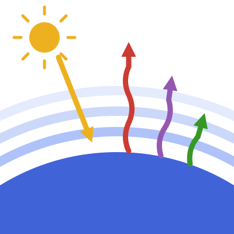

<div align="center">
  
</div>

# RRTMGP.jl

The `RRTMGP.jl` package is a Julia implementation of the radiative transfer
solver RTE (Radiative Transfer for Energetics) and the RRTMGP (RRTM for General
circulation model applications—Parallel) correlated-*k* gas optics
([Pincus et al., 2019](https://doi.org/10.1029/2019MS001621)), based on the
reference Fortran implementation
[rte-rrtmgp](https://github.com/earth-system-radiation/rte-rrtmgp). It computes
longwave and shortwave radiative fluxes and heating rates for clear, cloudy,
and aerosol-laden atmospheres, and is the radiation scheme of the
[CliMA Earth System Model](https://clima.caltech.edu).

|||
|-----------------:|:-------------------------------------------------------------|
| **Documentation**| [![stable][docs-stable-img]][docs-stable-url] [![dev][docs-dev-img]][docs-dev-url] |
| **Version**      | [![version][version-img]][version-url]                       |
| **License**      | [![license][license-img]][license-url]                       |
| **Tests**        | [![gha ci][gha-ci-img]][gha-ci-url] [![buildkite][bk-ci-img]][bk-ci-url] |
| **Code Coverage**| [![codecov][codecov-img]][codecov-url]                      |
| **Downloads**    | [![Downloads][dlt-img]][dlt-url]                             |

[docs-stable-img]: https://img.shields.io/badge/docs-stable-blue.svg
[docs-stable-url]: https://CliMA.github.io/RRTMGP.jl/stable/
[docs-dev-img]: https://img.shields.io/badge/docs-dev-blue.svg
[docs-dev-url]: https://CliMA.github.io/RRTMGP.jl/dev/
[version-img]: https://juliahub.com/docs/General/RRTMGP/stable/version.svg
[version-url]: https://juliahub.com/ui/Packages/General/RRTMGP
[license-img]: https://img.shields.io/badge/license-Apache%202.0-blue.svg
[license-url]: https://github.com/CliMA/RRTMGP.jl/blob/main/LICENSE
[gha-ci-img]: https://github.com/CliMA/RRTMGP.jl/actions/workflows/OS-UnitTests.yml/badge.svg
[gha-ci-url]: https://github.com/CliMA/RRTMGP.jl/actions/workflows/OS-UnitTests.yml
[bk-ci-img]: https://badge.buildkite.com/ee3a0c43cf4925ee14a966f794ac85d0b9439244d23e43b308.svg?branch=main
[bk-ci-url]: https://buildkite.com/clima/rrtmgp-ci/builds?branch=main
[codecov-img]: https://codecov.io/gh/CliMA/RRTMGP.jl/branch/main/graph/badge.svg
[codecov-url]: https://codecov.io/gh/CliMA/RRTMGP.jl
[dlt-img]: https://img.shields.io/badge/dynamic/json?url=http%3A%2F%2Fjuliapkgstats.com%2Fapi%2Fv1%2Ftotal_downloads%2FRRTMGP&query=total_requests&label=Downloads
[dlt-url]: https://juliapkgstats.com/pkg/RRTMGP

## Quick Start

### Installation

```julia
using Pkg
Pkg.add("RRTMGP")
```

### Basic Usage

The standalone entry points provide a quick start. A gray (single-band)
atmosphere uses analytic formulas:

```julia
using RRTMGP

out = RRTMGP.solve_gray(Float64; nlay = 60, ncol = 1)
out.net          # net flux at each level [W/m²]
out.heating_rate # radiative heating rate at each layer [K/s]
```

For the full correlated-*k* gas optics, build an idealized clear-sky profile
and solve it (the lookup tables are downloaded automatically; loading
`NCDatasets` activates them):

```julia
using RRTMGP, NCDatasets

profile = RRTMGP.standard_atmosphere(Float64; kind = :tropical)
out = RRTMGP.solve(profile)
out.lw_up[end, 1]   # outgoing longwave radiation at the top of the atmosphere [W/m²]
out.heating_rate    # radiative heating rate at each layer [K/s]
```

### Host-Model Usage

Climate models construct an `RRTMGPSolver` once, write their state through the
[getter contract](https://clima.github.io/RRTMGP.jl/latest/getters/), and call
`update_fluxes!(solver)` every radiation step:

```julia
solver = RRTMGP.RRTMGPSolver(grid_params, method, params, bcs_lw, bcs_sw, as)
RRTMGP.update_fluxes!(solver)          # allocation-free, in place
F = RRTMGP.net_flux(solver)            # (nlev, ncol) view into solver memory
```

This snippet is schematic;
[How to drive RRTMGP from a host model](https://clima.github.io/RRTMGP.jl/latest/howto/host_model/)
shows the full construction, step by step.

## Key Features

- **Full RRTMGP gas optics**: longwave and shortwave correlated-*k* lookup
  tables, clouds (with McICA sampling of partial cloudiness), and MERRA
  aerosols, validated against the Fortran rte-rrtmgp reference fluxes.
- **Gray radiation**: analytic single-band optics for idealized-climate and
  teaching use.
- **Two-stream and no-scattering solvers** for the longwave and shortwave,
  with optional per-band (spectrally resolved) flux output.
- **CPU and GPU**: the same code runs single-threaded, multi-threaded, and on
  CUDA GPUs via [ClimaComms](https://github.com/CliMA/ClimaComms.jl).
- **Zero-allocation driver**: `update_fluxes!` is allocation-free and
  type-stable, asserted in CI with `@allocated` and JET.
- **Dual precision**: `Float32` and `Float64` throughout;
  `Float32`↔`Float64` flux differences are of order 10⁻³ W/m² in the
  longwave and 10⁻² W/m² in the shortwave, enforced by ratcheting CI
  thresholds.

## Design

RRTMGP.jl is organized in three layers:

1. **Functional core**: `solve_lw!` / `solve_sw!` kernels acting on explicit
   state (`AtmosphericState`, optics, sources, boundary conditions, flux
   workspaces). See the [Functional core](https://clima.github.io/RRTMGP.jl/latest/functional_core/) page.
2. **Solver aggregate**: `RRTMGPSolver` bundles the configuration, state, and
   workspaces; hosts exchange data through documented
   [getters](https://clima.github.io/RRTMGP.jl/latest/getters/) and drive it
   with `update_fluxes!`.
3. **Standalone entry points**: `solve_gray(FT)`, `standard_atmosphere(FT)`,
   and `solve(profile)` for classroom use, single-column experiments, and
   quick starts.

Readers coming from the Fortran implementation can use the
[Fortran and paper concordance](https://clima.github.io/RRTMGP.jl/latest/concordance/)
to map names between the two code bases and the underlying papers.

## Documentation

- **[Documentation home](https://clima.github.io/RRTMGP.jl/latest/)**: overview
  and page index.
- **[Tutorials](https://clima.github.io/RRTMGP.jl/latest/tutorials/getting_started/)**:
  a first radiation calculation, and Manabe's radiative-convective equilibrium
  experiment as a single-column climate model.
- **[Functional core](https://clima.github.io/RRTMGP.jl/latest/functional_core/)**:
  the solver kernels, with runnable gray and clear-sky examples.
- **[Getter contract](https://clima.github.io/RRTMGP.jl/latest/getters/)**: the
  host data-exchange interface.
- **[API reference](https://clima.github.io/RRTMGP.jl/latest/api/)**: types and
  functions.

## Integration with Climate Models

RRTMGP.jl provides radiative fluxes and heating rates for the
[CliMA](https://github.com/CliMA) ecosystem, including:

- [ClimaAtmos](https://github.com/CliMA/ClimaAtmos.jl)
- [ClimaCoupler](https://github.com/CliMA/ClimaCoupler.jl)

## Getting Help

For questions, check the [documentation](https://clima.github.io/RRTMGP.jl/latest/)
or open an issue on [GitHub](https://github.com/CliMA/RRTMGP.jl).

## Contributing

Contributors should follow the shared CliMA engineering standards in
[`docs/dev-guides/`](docs/dev-guides/), which cover architecture, performance,
code quality, documentation, and workflows. These are vendored from
[CliMA/DeveloperGuides](https://github.com/CliMA/DeveloperGuides). The repo's
[`AGENTS.md`](AGENTS.md) is a starting point for AI agents with repo-specific
guidance.

## Acknowledgments

- Robert Pincus, Eli Mlawer, and Jennifer Delamere, the developers of RTE+RRTMGP
  and its reference [Fortran implementation](https://github.com/earth-system-radiation/rte-rrtmgp),
  on which this code is based.
- [Robert Pincus](https://github.com/RobertPincus) for his help and advice
  during development.
