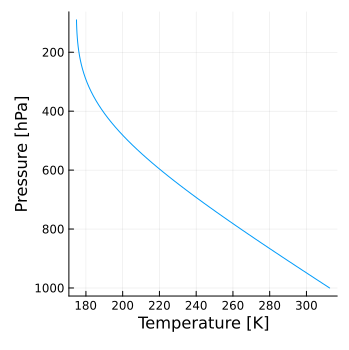
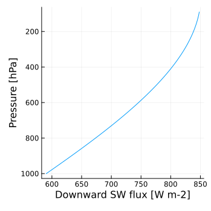
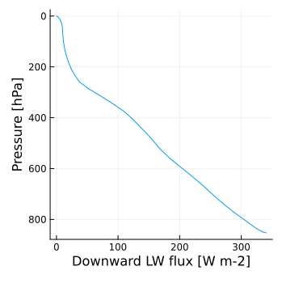
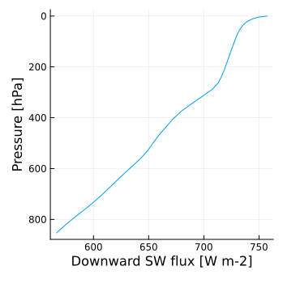
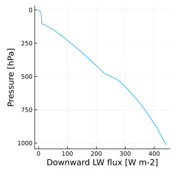
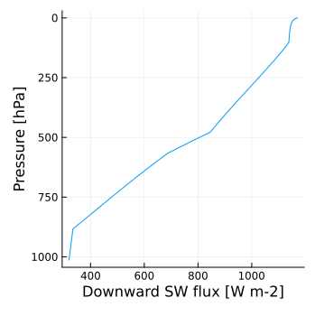

# How to run the validated test problems

The quickest way to run RRTMGP is the standalone gray-atmosphere entry point
`solve_gray`, which needs no NetCDF data. It builds its column internally, with
temperatures on the analytic semi-gray radiative-equilibrium profile of
[schneider2004](@cite), ``T(p) = T_t\,[1 + d_0\,(p/p_0)^α]^{1/4}``, where
``T_t = 200`` K is the temperature at the top of the atmosphere and the optical
depth ``d_0`` follows from a latitude-dependent radiative-equilibrium surface
temperature (a single column defaults to the equator):

```@example example
using RRTMGP

out = RRTMGP.solve_gray(Float64; nlay = 60, ncol = 1);

out.net_flux[end, 1] # net flux at the top of the atmosphere [W/m²]
```

To assemble the pieces yourself (the atmospheric state, the RTE workspaces, and
`solve_lw!`/`solve_sw!`), see [The functional core](@ref), which walks through
the gray problem and sketches the clear-sky path.

Beyond that, the test suite serves as a set of complete, validated examples, run
from the repository root with the `test` project (`julia --project=test`). The
gray driver checks the solvers against analytic solutions. The clear-sky and
all-sky drivers build their states from standardized NetCDF inputs and compare
the computed fluxes against the reference results of the Fortran implementation
[rte-rrtmgp](https://github.com/earth-system-radiation/rte-rrtmgp) for the RFMIP
clear-sky case and the all-sky example, distributed through the
[rrtmgp-data](https://github.com/earth-system-radiation/rrtmgp-data) repository
and downloaded automatically as artifacts (see `test/reference_files.jl`). These
are the same reference data the Fortran implementation validates against, so the
tolerances are directly comparable.

## Gray radiation

`test/gray_atm.jl` exercises longwave and shortwave gray radiation with both the
non-scattering and two-stream solvers. For longwave-only gray radiation, an
analytical radiative-equilibrium solution exists; `gray_atmos_lw_equil`
integrates to equilibrium and compares against it:

```julia
julia> include("test/gray_atm_utils.jl");

julia> gray_atmos_lw_equil(ClimaComms.context(), TwoStreamLWRTE, Float64);
Test Passed
```

Here is the vertical profile of temperature (`T_ex_lev`) in radiative
equilibrium:



`gray_atmos_sw_test` computes shortwave-only gray fluxes and compares to the
exact solution:

```julia
julia> gray_atmos_sw_test(ClimaComms.context(), TwoStreamSWRTE, Float64, 1);
Test Passed
```

Here is the vertical profile of the downward shortwave radiative flux
(`flux_dn_dir`):



## Gas optics (clear sky)

`test/clear_sky.jl` runs RRTMGP for the RFMIP clear-sky atmosphere states and
compares the results to the reference fluxes (running the file drives both
longwave solver types and the two-stream shortwave solver at `ncol = 250`):

```julia
julia> include("test/clear_sky.jl")
```

Here are the vertical profiles of downward longwave (`flux_dn_lw`) and shortwave
(`flux_dn_sw`) fluxes for the first column:

 

## Cloud and aerosol optics (all sky)

`test/all_sky_with_aerosols.jl` runs RRTMGP for all-sky atmosphere states with
idealized clouds (uniform condensate and particle size in the troposphere, McICA
cloud sampling) plus MERRA aerosols, and compares the results to the reference
fluxes:

```julia
julia> include("test/all_sky_with_aerosols.jl")
```

Here are the vertical profiles of downward longwave (`flux_dn_lw`) and shortwave
(`flux_dn_sw`) fluxes for the first column:

 

## Related datasets

The [rte-examples](https://github.com/earth-system-radiation/rte-examples)
repository provides standardized *input* datasets (RFMIP, CKDMIP evaluation
profiles, an idealized RCE profile) without committed reference fluxes; since
its problems overlap the RFMIP cases already covered here, RRTMGP.jl does not
vendor it. Its idealized RCE setup is realized instead as the
[radiative-convective equilibrium tutorial](tutorials/manabe_rce.md).
