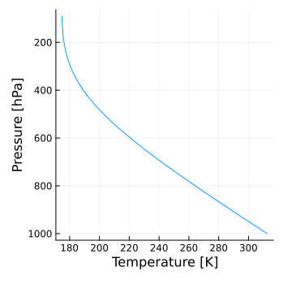
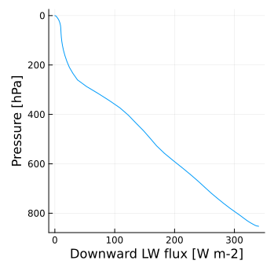
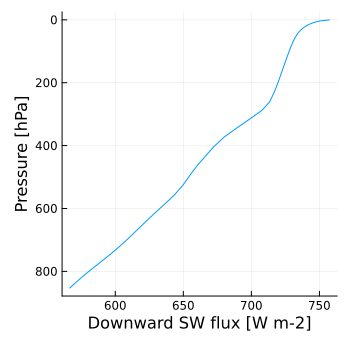

# Example
A suite of concrete examples are provided here as a guidance for using RRTMGP. The example code is in the `test` folder. 

## Gray radiation
`gray_atm.jl` tests longwave and shortwave gray radiation. For longwave-only gray radiation (i.e., an atmosphere transparent to solar radiation), an analytical solution exists for the radiative equilibrium. `gray_atmos_lw_equil` computes radiative equilibrium with longwave-only gray radiation and compares the result against the analytical solution.

```julia
julia> include("test/gray_atm.jl")
julia> gray_atmos_lw_equil(TwoStream, Float64, Int, DA, Int(1))
*************************************************
Longwave test for gray atmosphere model - TwoStream; ncol = 1; DA = Array
Integration time = 40.0 years
t_error = 0.006105025574186129; flux_grad_err = 9.999832315088497e-6
Test Passed
```

Here is the vertical profile of temperature (`T_ex_lev`) in radiative equilibrium:



`gray_atmos_sw_test` computes radiative fluxes with shortwave-only gray radiation and compares the result to the exact solution.
```julia
julia> include("test/gray_atm.jl")
julia> gray_atmos_sw_test(TwoStream, Float64, Int, DA, Int(1))
*************************************************
Running shortwave test for gray atmosphere model - TwoStream; ncol = 1; DA = Array
relative error = 5.776373821376071e-16
Test Passed
```

Here is the vertical profile of the downward shortwave radiative flux (`flux_dn_dir`):


## Gas optics
`clear_sky.jl` runs RRTMGP for specific clear-sky atmosphere states and compares the results to reference data. The atmosphere states and reference data are stored in netcdf files [here](https://caltech.box.com/shared/static/wbtrwp44dyn08g7mozjf4fcyrexwbe6a.gz).
```julia
julia> include("test/clear_sky.jl")
julia> clear_sky(TwoStream, SourceLW2Str, VmrGM, Float64, Int, array_type())
calling longwave solver; ncol = 100
  0.597229 seconds (1.54 k allocations: 344.438 KiB)
calling shortwave solver; ncol = 100
  0.449502 seconds (1.34 k allocations: 283.938 KiB)
=======================================
Clear-sky longwave test - TwoStream
max_err_flux_up_lw = 1.611013158253627e-5
max_err_flux_dn_lw = 1.6820160510633286e-5
Clear-sky shortwave test, opc  = TwoStream
max_err_flux_up_sw = 4.354144800799986e-5
max_err_flux_dn_sw = 0.00018220861784357112
=======================================
Test Passed
```

Here are the vertical profiles of downward longwave (`flux_dn_lw`) and shortwave (`flux_dn_sw`) fluxes for the first column:

 

## Cloud optics
`all_sky.jl` runs RRTMGP for specific all-sky atmosphere states with arbitrary clouds and compares the results to reference data. The atmosphere states and reference data are stored in netcdf files [here](https://caltech.box.com/shared/static/wbtrwp44dyn08g7mozjf4fcyrexwbe6a.gz). The clouds are very idealized, with uniform condensate and particle size everywhere in the troposphere (though with different values for liquid and ice). Fractional cloudiness is not considered.

```julia
julia> include("test/all_sky.jl")
julia> all_sky(TwoStream, Float64, Int, DA, use_lut = true, cldfrac = Float64(1))
calling longwave solver; ncol = 128
  1.357532 seconds (141.42 k allocations: 7.896 MiB, 25.54% compilation time: 100% of which was recompilation)
calling shortwave solver; ncol = 128
  0.834152 seconds (60.46 k allocations: 3.683 MiB, 39.67% compilation time: 100% of which was recompilation)
=======================================
Cloudy-sky longwave test - TwoStream
Lookup Table Interpolation method
max_err_flux_up_lw = 8.359090770682087e-7
max_err_flux_dn_lw = 1.7562185803399188e-6
Cloudy-sky shortwave test - TwoStream
Lookup Table Interpolation method
max_err_flux_up_sw = 4.038832912556245e-8
max_err_flux_dn_sw = 1.6986234641080955e-7
=======================================
Test Passed
```

Here are the vertical profiles of downward longwave (`flux_dn_lw`) and shortwave (`flux_dn_sw`) fluxes for the first column:

 